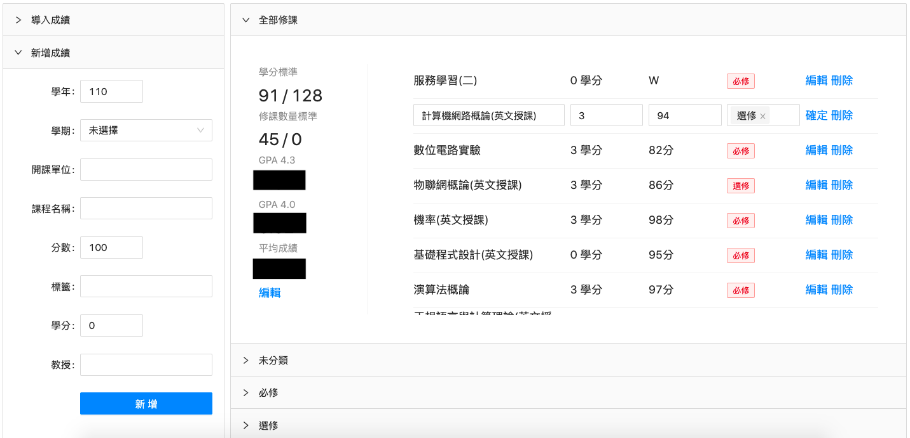

## Just 4 Fun

- **網址**：https://1am9trash.github.io/Just_4_Fun/

- **內容**：React 框架做的學分計算網站

  

- **待實做的功能**：

  - [x] 導入成績
  - [x] 編輯／刪除課程
  - [x] 計算統計資料
  - [x] 編輯修課標準
  - [ ] 連接後端，建立存檔
  - [ ] 架構優化

- **修改**：

  - 移到網頁文件所在的檔案夾：`cd web`
  - 下載 package.json 中的依賴包：`npm install`
  - 開啟 server：`npm start`
